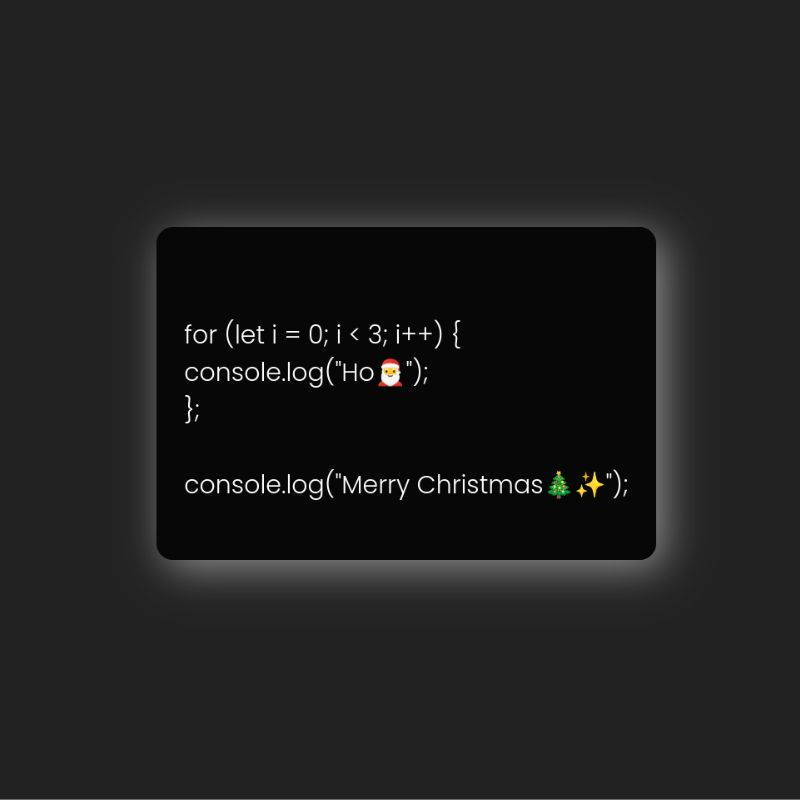

# Christmas Card 🎄
## Mini Application for DOM Practice with Audio Effect 🎶

### Tools I used
  
  
  

#### 🔸CapCut / Filmora
In this project, I utilized CapCut and Filmora to skillfully edit Santa's sound for adding a delightful and magical touch to the holiday experience.   

#### 🔸Vanilla Tilt
For enhancing interactive elements, I integrated [Vanilla Tilt](https://micku7zu.github.io/vanilla-tilt.js/), incorporating dynamic movement into the project.  
Leveraging Vanilla Tilt's features, I implemented visual motion to elevate the user experience.  

 

❄ Happy Winter Holiday ❄  
🎅 [from santa](https://yukosuga.github.io/christmas-card/) 💌✨